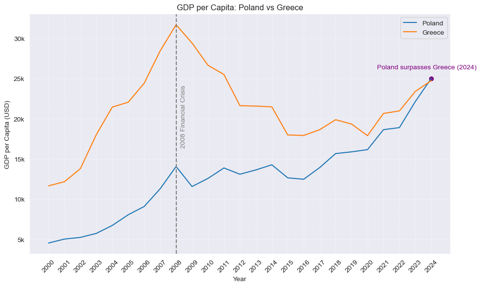
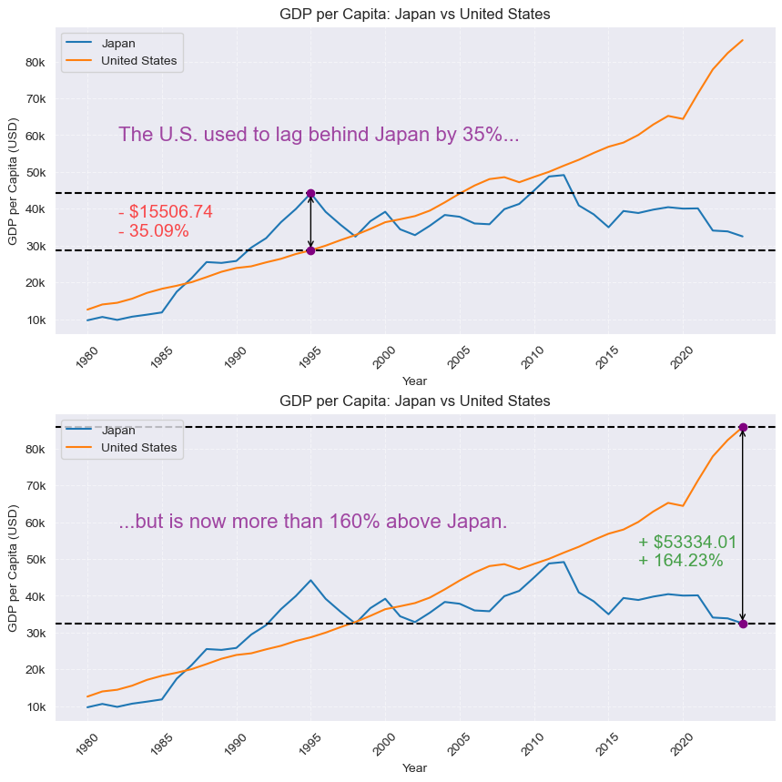
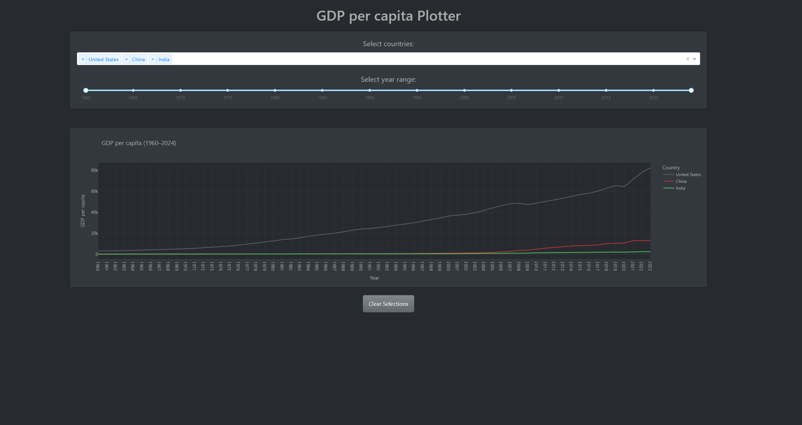
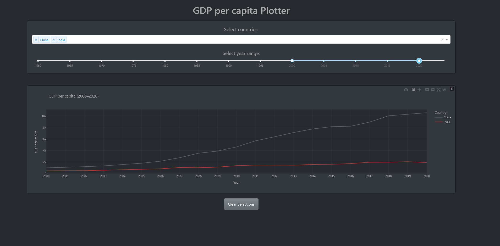
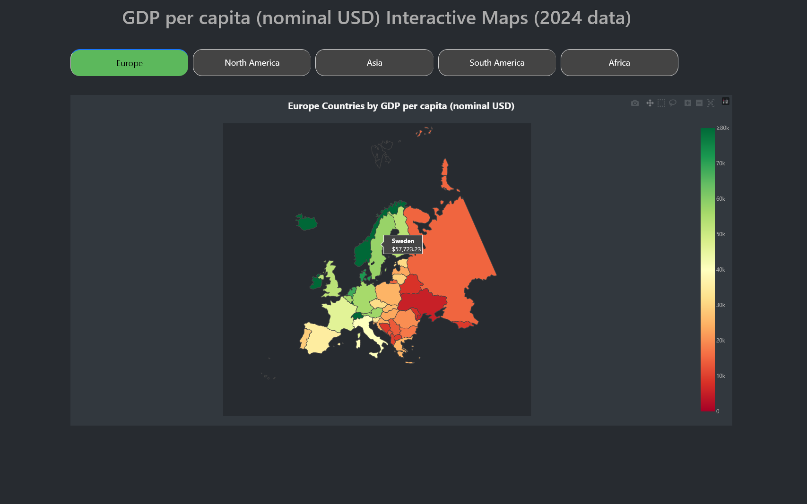
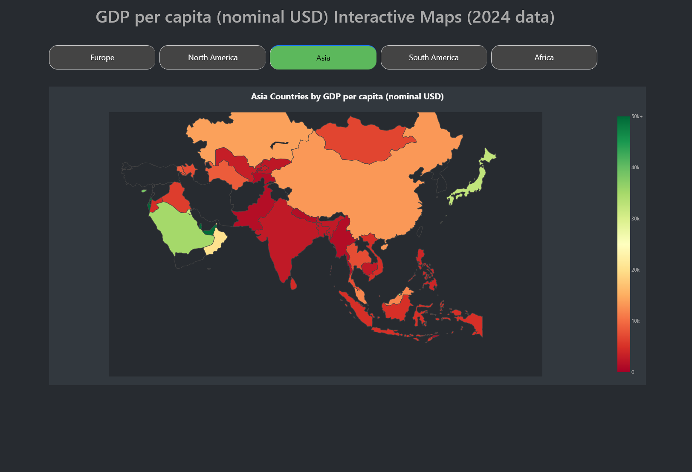

# GDP Analysis and Interactive Visualizations

Exploratory analysis and interactive visualizations of GDP per capita (nominal USD) using the included World Bank's CSV dataset (`gdp_pc_data.csv`). This repository contains Jupyter notebooks and python scripts for static plotting and interactive Dash apps that let you explore GDP-per-capita trends.

## Table of Contents

- [Overview](#overview)
- [Notebooks & Key Files](#notebooks--key-files)
- [Installation](#installation)
- [Examples](#examples)
- [License](#license)
- [Contributing](#contributing)
- [Author & Contact](#author--contact)

## Overview

This project contains a few jupyter notebooks that allow the user to explore interesting GDP per capita trends in an interesting and engaging way.

## Notebooks & Key Files
- `gdp_plots.ipynb`: Static exploratory plots using `pandas`, `seaborn` and `matplotlib` (time series comparisons between countries).
- `gdp_graph_choice.ipynb`: Interactive Dash app to plot GDP-per-capita time series for selected countries and year ranges (uses `plotly.express`, `dash`, and `dash_bootstrap_components`).
- `gdp_maps.ipynb`: Interactive Dash choropleth maps for 2024 GDP-per-capita (uses `plotly.express`, `pycountry`, and Dash components).
- `gdp_pc_data.csv`: Primary dataset used by the notebooks (included in this repository).
- `assets/style.css`: styling used by the notebooks or dashboards (if referenced).

## Installation

1. Clone the repository

```bash
git clone https://github.com/Sebastijan-Dominis/gdp_analysis
```

2. Create and activate a python virtual environment

- If using Anaconda:
```bash
conda create -n gdp_analysis python=3.14 -y
conda activate gdp_analysis
```

3. Install the requirements

```bash
pip install -r requirements.txt
```

4. Open and run the jupyter notebooks

- `gdp_plots.ipynb` — run the cells to generate static visualizations.
- `gdp_graph_choice.ipynb` — run all cells to start the interactive Dash plotter.
- `gdp_maps.ipynb` — run all cells to start the interactive choropleth maps.

> When the Dash apps are started from the notebooks you will typically see a local server URL printed in the notebook output (e.g. `http://127.0.0.1:8050`) — open that URL in your browser to interact with the app.

#### Running the Dash apps as scripts (optional)

- If you prefer to run the Dash apps as standalone Python scripts:

```bash
python gdp_graph_choice.py
```

```bash
python gdp_maps.py
```

## Examples

### Plots

- Start `gdp_plots.ipynb` to create comparison plots (matplotlib/seaborn).





### Interactive plots

- Start `gdp_graph_choice.ipynb` to pick countries and year ranges interactively





### Interactive maps

- Start `gdp_maps.ipynb` to view choropleth maps for 2024.





## License
- This repository includes a `LICENSE` file — please review it for terms of reuse.

## Contributing
- Improvements and bug fixes welcome. Open an issue or submit a pull request with a clear description of the change.

## Author & Contact
- Author: Sebastijan Dominis
- Contact: sebastijan.dominis99@gmail.com
